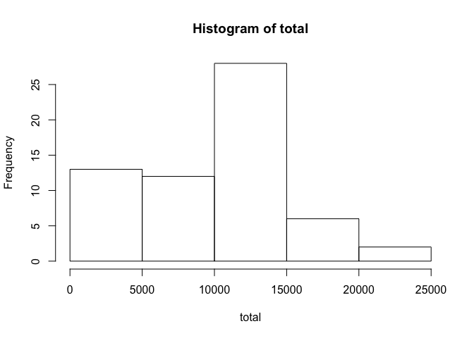
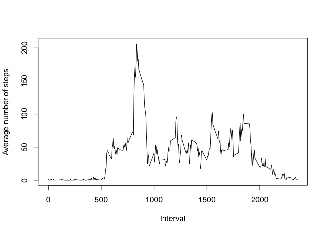
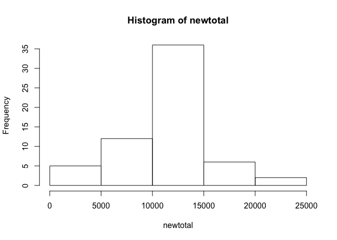
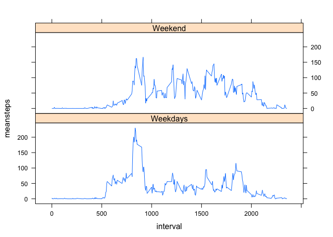

## Loading and preprocessing the data

To load the data into R, we use the `read.csv` function and then we cast the date column as the Date type.


```r
data = read.csv("activity.csv")
data$date <- as.Date(data$date, "%Y-%m-%d")
```

We are now ready to start working with the data in order to answer the assignment questions.

## What is mean total number of steps taken per day?

1. Calculate the total number of steps taken per day

    
    ```r
    total <-tapply(data$steps,data$date,sum, na.rm=TRUE)
    ```

2. Histogram for the total number of steps taken each day

     

3. Mean and Median of the total number of steps taken per day

    
    ```r
    summary(total)
    ```
    
    ```
    ##    Min. 1st Qu.  Median    Mean 3rd Qu.    Max. 
    ##       0    6778   10400    9354   12810   21190
    ```

## What is the average daily activity pattern?

1. Time series plot of the 5-minute interval and the average number of steps

    
    ```r
    library(dplyr)
    group1 <- group_by(data,interval)
    average <- summarize(group1, avesteps = mean(steps,na.rm=TRUE))
    ```

     

2. Maximum number of steps

    
    ```r
    average[which(average$avesteps==max(average$avesteps)),]
    ```
    
    ```
    ## Source: local data frame [1 x 2]
    ## 
    ##   interval avesteps
    ## 1      835 206.1698
    ```

## Imputing missing values

1.  Total number of missing values

    
    ```r
    data$isna <- is.na(data$steps)
    table(data$isna)
    ```
    
    ```
    ## 
    ## FALSE  TRUE 
    ## 15264  2304
    ```

2. Using the mean for that 5-minute interval for missing data

3. Create a new dataset 
    
    ```r
    data1 <- as.data.frame(unique(data$interval))
    mbyintv <-tapply(data$steps,data$interval,mean, na.rm=TRUE)
    mbyintv <- as.data.frame(mbyintv)
    data2 <- cbind(data1,mbyintv)
    colnames(data2) <- c("n_interval", "aver")
    data$aver <- data2$aver[match(data$interval,data2$n_interval)]
    data$nsteps <- ifelse(data$isna==TRUE, data$aver, data$steps)
    newdata <- data[,c("date","nsteps","interval")]
    ```

4. Histogram for the total number of steps taken each day

    
    ```r
    newtotal <-tapply(newdata$nsteps,newdata$date,sum, na.rm=TRUE)
    summary(newtotal)
    ```
    
    ```
    ##    Min. 1st Qu.  Median    Mean 3rd Qu.    Max. 
    ##      41    9819   10770   10770   12810   21190
    ```

     

Yes. The results are very different. After replacing missing value with the mean for 5-mins interval, the distribution is closer to normal distribution.

## Are there differences in activity patterns between weekdays and weekends?

1. Create a new factor variable 

    
    ```r
    newdata$date <- as.Date(newdata$date)
    newdata$day <- weekdays(newdata$date)
    newdata$weekend <- ifelse(newdata$day=="Sunday"|newdata$day=="Saturday",1,0)
    newdata$weekend <- as.factor(newdata$weekend)
    levels(newdata$weekend) <- c("Weekdays", "Weekend")
    ```

2. Time series plot of the 5-minute interval and the average number of steps for weekend and weekdays seperately.

    
    ```r
    library(dplyr)
    group <- group_by(newdata,interval,weekend)
    groupdata <- summarize(group, meansteps = mean(nsteps))
    ```

     


